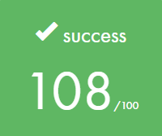
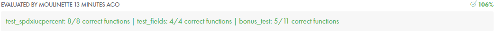

# ft_printf

### Final Score

### First Try

------

**\- conversions : cspdiuxX% [OK]**

**\- bonus : " +", "l_ll_hh" [OK]**

**\- bonus : "~~nfge~~", "~~#~~", "~~h~~" [KO]**

### Reference

------

###### format specifier

* https://dojang.io/mod/page/view.php?id=736
* http://www.cplusplus.com/reference/cstdio/printf/

###### Test Program

* https://github.com/Mazoise/42TESTERS-PRINTF
* https://github.com/gavinfielder/pft
* https://github.com/cclaude42/PFT_2019
* https://github.com/charMstr/printf_lover_v2