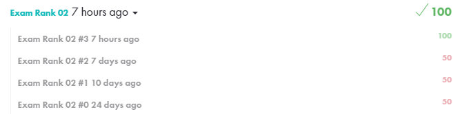

# Exam Rank 02

### Final Score

### First Try

1. **Inter, get_next_line :: 파싱은 성공했으나, memory leak 못 잡음. (test.sh 오류)**
2. **Inter, get_next_line :: 파싱 성공, test.sh 성공, 결과 값도 동일. But, memory leak...**
3. **Inter, ft_printf :: 예제와 동일한 결과 값 (예외사항: 숫자 출력시 0이 하나 더 출력되는 예제들이 존재)**
4. **Union, ft_printf :: Perfect, Success;**

### Reference

* **Inter :: 문자열 교집합 문제**
* **Union :: 문자열 합집합 문제**
* **get_next_line :: 프로토타입 int get_next_line(char \*\*line);**
* **ft_printf :: %s, %d, %x 와 "." flag** 

